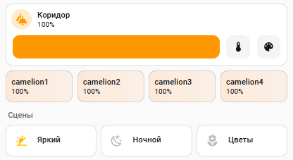

<p align="center">
  
  
  
</p>

<h1 align="center">💡 Koridor Light PRO</h1>

<p align="center">
  Панель освещения коридора: группа, лампы-пилюли с живым градиентом,<br>
  сцены с честной индикацией и управляемая память состояний<br>
  <i>Один package-файл · один стек карточки · две зависимости из HACS</i>
</p>

<p align="center">
  
  
</p>

## ✨ Что внутри

- 💡 **Группа** — полное управление: яркость, цветовая температура, RGB, слайдер
- 🎬 **3 сцены**: Яркий (100%, 4000K), Ночной (10%, 2700K), Цветы (акцент RGB на одной лампе)
- 🟪 **Лампы-пилюли** — узкие карточки без иконок: имя + состояние, слайдер, тап = вкл/выкл
- 🌈 **Живой градиент** — фон пилюли = цвет лампы до процента яркости, обновляется на лету
- 🔘 **Честная индикация сцен** — кнопка светится, только если сцена применена последней
  И свет реально в её состоянии
- 🧠 **Управляемая память** — выключили свет → память сцены умирает; включили группу
  с мёртвой памятью → чистый старт (днём Яркий, после заката Ночной), без зомби-обрывков
- 🎨 **Темы** — поверхности через `var(--…)`, нативно в светлой и тёмной
- 🧩 **Package-подход** — один файл, не ломает `configuration.yaml`

## 🧩 Требования

- Home Assistant **2024.8+**
- HACS (Frontend): **mushroom-cards**, **card-mod**
- Группа ламп (`light.koridor`) и 4 управляемые лампы (RGB или CCT)

## 🚀 Установка

1. HACS → Frontend → установите **mushroom-cards** и **card-mod**.
2. Скопируйте `packages/koridor.yaml` в `/config/packages/`.
3. В `configuration.yaml` (один раз):
   ```yaml
   homeassistant:
     packages: !include_dir_named packages
   ```
4. Замените entity_id ламп и группы на свои в обоих файлах
   (`light.camelion1…4`, `light.koridor` — в package и в карточке).
5. **Перезапустите HA** — packages и их автоматизации читаются только при старте.
6. Дашборд → ⋮ → Редактор кода → вставьте `lovelace/koridor_card.yaml`.

## ⚙️ Настройка

| Что заменить | Где | Пример |
|---|---|---|
| `light.camelion1…4` | package + карточка | `light.yeelight_1…4` |
| `light.koridor` | package + карточка | `light.hallway` |
| `brightness: 255/25/38` | package | яркость сцен (0–255) |
| `rgb_color: [148, 0, 211]` | package | цвет акцент-сцены |
| `delay: "00:00:02"` | автоматизация clean_on | пауза под скорость ваших ламп |

## 🧠 Как работает память состояний

1. Нажали сцену → скрипт пишет имя сцены в `input_text.koridor_last_scene` и применяет сцену.
2. Выключили коридор → автоматизация стирает память в `none`.
3. Включили группу с мёртвой памятью → лампы на миг восстанавливают последние цвета,
   затем автоматизация «чистый старт» (пауза 2 c на отчёт ламп + проверка «все вкл»)
   применяет дефолтную сцену: днём Яркий, после заката Ночной.
4. Включили одну лампу пилюлей → условие «все четыре вкл» не выполнено → локальное
   управление не трогается.

Индикация сцен = память + фактическое состояние света: поменяли яркость вручную —
подсветка погасла; выключили — умерла мгновенно.

## ❓ FAQ

**Q: Пилюли без иконок — как вернуть?**
A: Удалите блок `mushroom-state-item$: | .icon { display: none … }` в карточках ламп.

**Q: Градиент не появляется.**
A: Проверьте card-mod (HACS → Frontend), обновите и сделайте Ctrl+F5.

**Q: После включения группы лампы вспыхивают старыми цветами.**
A: Это восстановление последних состояний ламп; через ~2 c чистый старт приводит всё
   к дефолту. Увеличьте `delay`, если железо медленнее.

**Q: Лампы только CCT, без RGB.**
A: Замените `rgb_color` сцены «Цветы» на `color_temp_kelvin` — градиент подхватит цвет сам.

## 🛠 Troubleshooting

| Симптом | Решение |
|---|---|
| Автоматизаций нет в списке | Перезапуск HA (packages читаются при старте) |
| Чистый старт не срабатывает | Трассировка `koridor_clean_on`: память не `none` или лампа не `on` |
| Сцены не подсвечиваются | Сверьте entity_id и значение `input_text.koridor_last_scene` |
| Пилюли слишком узкие | `columns: 4` → `3` или `2` |
| Заливка бледная | Альфы `0.40/0.22` → `0.55/0.35` |

## 🗺 Roadmap

- [ ] Чистый старт без задержки (метки ручного управления или wait_template)
- [ ] Плавные переходы (transition) между сценами
- [ ] Wall-версия для настенной панели
- [ ] Пресеты «Утро / День / Вечер»

## 📄 Лицензия

MIT © [NikolaYudin]. См. [LICENSE](LICENSE).

---

<p align="center"><i>Пригодилось — поставьте ⭐</i></p>
